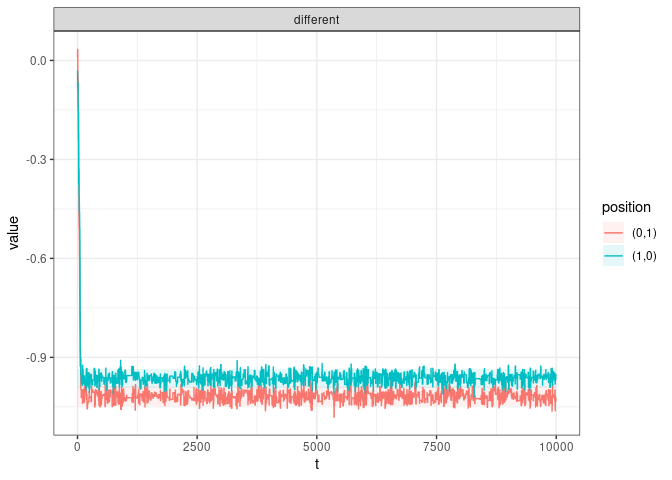
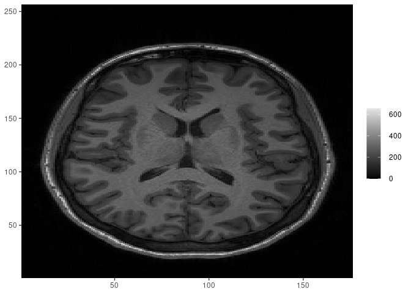
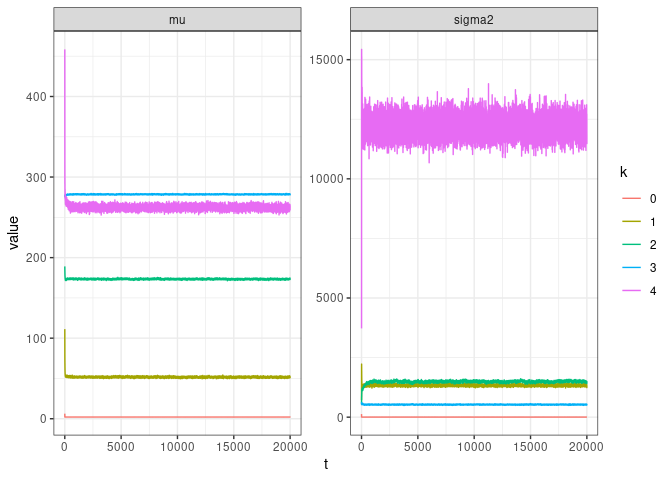
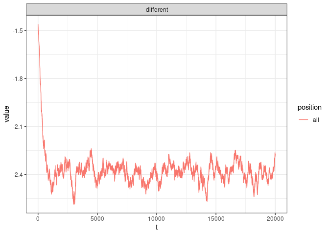
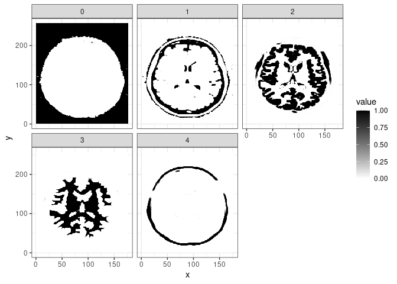

<!-- README.md is generated from README.Rmd. Please edit that file -->

# mrf2dbayes

<!-- badges: start -->

[](https://github.com/Freguglia/mrf2dbayes/actions)
[](https://lifecycle.r-lib.org/articles/stages.html#experimental)
<!-- badges: end -->

The goal of `mrf2dbayes` is to provide out-of-the-box implementations of
Bayesian inference algorithms for Markov Random Fields on 2-dimensional
lattices with pairwise interactions. It can be viewed as a Bayesian
extension of the [`mrf2d`](https://github.com/Freguglia/mrf2d) package.

## Installation

<!--You can install the released version of mrf2dbayes from [CRAN](https://CRAN.R-project.org) with:

``` r
install.packages("mrf2dbayes")
```

-->

The development version from [GitHub](https://github.com/) can be
installed with:

``` r
# install.packages("devtools")
devtools::install_github("Freguglia/mrf2dbayes")
```

## Functionalities

### Likelihood approximations

Because the likelihood function for Markov Random Fields is unavailable
due to an intractable normalizing constant, `mrf2dbayes` uses an
approximate-posterior distribution approach, which substitutes the
likelihood function for an approximation in the acceptance ratio of the
Metropolis-Hastings algorithm steps.

log-Likelihood approximations are represented by `llapprox` object.
These can be created with the homonym function `llapprox()` and passing
a reference field, an interaction structure (`mrfi` object from
`mrf2d`), an interaction family (also introduced in `mrf2d`), a method
and its related additional arguments.

Approximation methods currently implemented are:

-   `"pseudo"`: Pseudolikelihood approximation.
-   `"gt"`: Monte-Carlo Likelihood approximation from Geyer & Thompson
    (1992).
-   TODO: `"wl"`: Wang-Landau algorithm.
-   TODO: `"cpseudo"`: Corrected Pseudolikelihood approach from …

``` r
library(mrf2dbayes)
# Example MRF from mrf2d
z <- mrf2d::Z_potts

lla <- llapprox(z, mrfi(1), "oneeach", method = "pseudo")
```

### MRF parameters posterior sampling

`mrfbayes()` runs a Metropolis-Hastings algorithm to sample from the
posterior distribution of the MRF parameters considering centered
Gaussian priors and Gaussian transition kernels. It takes an observed
(discrete) random field, `llapprox` object and the size of the chain
(`nsamples`) as arguments, as well as other arguments to control
parameters such as the prior distribution variance and the transition
kernel variance.

``` r
metrop <- mrfbayes(z, lla, nsamples = 10000)
```

A `mrfbayes_out` object is returned. `plot()` and `summary()` methods
are available.

``` r
plot(metrop)
```



``` r
summary(metrop)
#> # A tibble: 2 × 6
#> # Groups:   position [2]
#>   position interaction   q025   mean   q975     sd
#>   <fct>    <fct>        <dbl>  <dbl>  <dbl>  <dbl>
#> 1 (0,1)    different   -1.05  -1.02  -0.987 0.0153
#> 2 (1,0)    different   -0.993 -0.963 -0.934 0.0151
```

### Hidden MRF Bayesian analysis

Considering a Gaussian mixture driven by a Hidden MRF, a
Metropolis-Within-Gibbs approach is used to sample the hidden (latent)
field, the parameters of the hidden MRF and the parameters of the
emission distribution simultaneously.

A Gaussian prior is used for the means of the emission distribution and
an Inverse-Gamma for the variances.

``` r
bold5000 <- mrf2d::bold5000
# Dummy discrete field as reference
dummy <- matrix(sample(0:4, 
                       prod(dim(bold5000)), replace = TRUE),
                nrow = nrow(bold5000), ncol = ncol(bold5000))

lla_bold <- llapprox(dummy, mrfi(1), "onepar", method = "pseudo")
```

``` r
hmrf_metrop <- hmrfbayes(bold5000, lla_bold, nsamples = 20000)
```

``` r
mrf2d::cplot(bold5000)
```



``` r
plot(hmrf_metrop, "pars")
```



``` r
plot(hmrf_metrop, "theta")
```



``` r
plot(hmrf_metrop, "zprobs")
```


